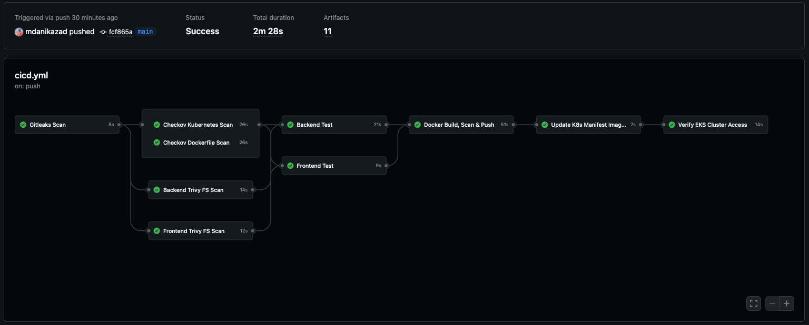
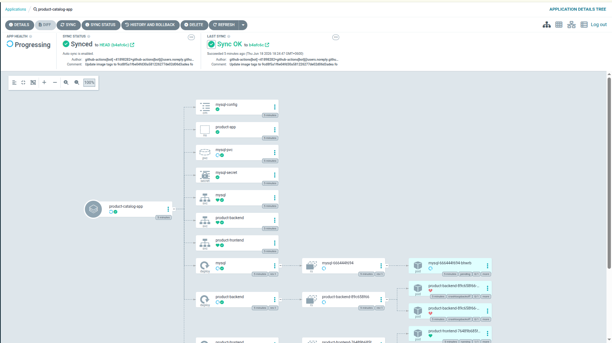
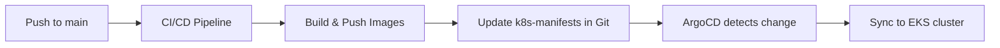

<div align="center">

# Production-Grade 3-Tier DevSecOps Project

### End-to-End DevSecOps Pipeline · AWS EKS · GitOps with ArgoCD

A complete **3-tier Product Catalog** application shipped the DevSecOps way — every commit is scanned, tested, containerized, and continuously delivered to an **Amazon EKS** cluster through a **GitOps workflow powered by ArgoCD**.


</div>

---

## Table of Contents

- [What This Project Demonstrates](#what-this-project-demonstrates)
- [Live Screenshots](#live-screenshots)
- [Architecture](#architecture)
- [Tech Stack](#tech-stack)
- [The Application](#the-application)
- [DevSecOps CI/CD Pipeline](#devsecops-cicd-pipeline)
- [GitOps Deployment with ArgoCD](#gitops-deployment-with-argocd)
- [Setup Guide](#setup-guide)
- [Troubleshooting](#troubleshooting)
- [Security Notes](#security-notes)
- [Author](#author)

---

## What This Project Demonstrates

This is a **full DevSecOps project**, not just an app deployment. It wires together security, automation, and GitOps end to end:

- **Shift-left security** — secret scanning, IaC scanning, dependency & image scanning on every push.
- **Automated CI/CD** — a single GitHub Actions pipeline handles scan → test → build → push → release.
- **GitOps delivery** — **ArgoCD** is the single source of truth. The pipeline never runs `kubectl apply`; it only updates manifests in Git, and ArgoCD reconciles the cluster.
- **Cloud-native runtime** — runs on a real **Amazon EKS** cluster (`onik-eks-cluster-testing`, region `us-east-1`).
- **3-tier separation** — independent Frontend, Backend, and MySQL database tiers.

---

## Live Screenshots

### DevSecOps CI/CD Pipeline (GitHub Actions)

The complete pipeline running on a push to `main` — security scans, tests, Docker build & push, manifest update, and EKS verification, all green.



### GitOps Deployment (ArgoCD UI)

ArgoCD continuously watching the `k8s-manifests/` folder in Git and reconciling the application tree (Frontend, Backend, MySQL, Services, Secrets, PVC) onto the EKS cluster.



---

## Architecture



### How a change flows to production

1. Developer pushes code to `main`.
2. GitHub Actions runs all **security scans** and **tests**.
3. Docker images are **built, scanned with Trivy, and pushed** to Docker Hub (tagged with the commit SHA).
4. The pipeline **commits the new image tags** into `k8s-manifests/` in Git.
5. **ArgoCD detects the Git change** and **auto-syncs** the cluster to match.
6. EKS pulls the new images and rolls out the updated pods.

> The desired state always lives in Git. The cluster is reconciled to Git — never the other way around. That is GitOps.

---

## Tech Stack

| Category | Technology |
|----------|------------|
| **Frontend** | Node.js 18, Express 5 (UI server + API proxy) |
| **Backend** | Node.js 18, Express 5, MySQL2 (REST API) |
| **Database** | MySQL 8 (with PersistentVolumeClaim) |
| **Containerization** | Docker, Docker Hub |
| **CI/CD** | GitHub Actions |
| **Secret Scanning** | Gitleaks |
| **IaC / Config Scanning** | Checkov (Kubernetes + Dockerfile) |
| **Vulnerability Scanning** | Trivy (filesystem + image) |
| **Orchestration** | Kubernetes — **Amazon EKS** |
| **GitOps / CD** | **ArgoCD** |
| **Cloud** | AWS (`us-east-1`) |

---

## The Application

A **Product Catalog** with a clean 3-tier separation.

### Request flow

```
Browser → Frontend (NodePort 30080) → /api proxy → Backend (5000) → MySQL (3306)
```

The frontend serves the UI and proxies all `/api/*` calls to the backend service inside the cluster, so the browser only ever talks to the frontend.

---

## DevSecOps CI/CD Pipeline

Defined in [`.github/workflows/cicd.yml`](.github/workflows/cicd.yml) and triggered on every push to `main` that touches the app or manifests.

### Pipeline jobs

| # | Job | Tool | Purpose |
|---|-----|------|---------|
| 1 | **Gitleaks Scan** | Gitleaks | Detect hardcoded secrets / credentials in the repo |
| 2 | **Checkov K8s Scan** | Checkov | Find misconfigurations in Kubernetes manifests |
| 3 | **Checkov Dockerfile Scan** | Checkov | Enforce Dockerfile best practices |
| 4 | **Frontend Trivy FS Scan** | Trivy | Scan frontend dependencies for CVEs |
| 5 | **Backend Trivy FS Scan** | Trivy | Scan backend dependencies for CVEs |
| 6 | **Frontend Test** | npm | Run frontend tests |
| 7 | **Backend Test** | npm | Run backend tests |
| 8 | **Docker Build, Scan & Push** | Docker + Trivy | Build images, scan them, push to Docker Hub |
| 9 | **Update K8s Manifest Image Tags** | sed + git | Write new SHA image tags into `k8s-manifests/` for ArgoCD |
| 10 | **Verify EKS Cluster Access** | AWS CLI + kubectl | Confirm AWS credentials & EKS connectivity |

### Why there is no `kubectl apply` here

Deployment is **100% GitOps**. The CI pipeline's job ends at updating Git. **ArgoCD** is solely responsible for applying changes to the cluster — this gives you auditability, easy rollback (just revert a commit), and drift detection (`selfHeal`).

### Required GitHub Secrets & Variables

Configure under **Repo → Settings → Secrets and variables → Actions**:

| Name | Type | Purpose |
|------|------|---------|
| `AWS_ACCESS_KEY_ID` | Secret | AWS access key for EKS verification |
| `AWS_SECRET_ACCESS_KEY` | Secret | AWS secret key for EKS verification |
| `DOCKERHUB_TOKEN` | Secret | Push images to Docker Hub |
| `DOCKERHUB_USERNAME` | Variable | Docker Hub username (`822800`) |

---

## GitOps Deployment with ArgoCD

ArgoCD is the **continuous delivery** engine. It is configured via [`k8s-manifests/argocd/application.yaml`](k8s-manifests/argocd/application.yaml):

```yaml
source:
  repoURL: https://github.com/mdanikazad/production-grade-three-tier-DevSecOps-project.git
  targetRevision: main
  path: k8s-manifests
destination:
  namespace: product-app
syncPolicy:
  automated:
    prune: true        # delete resources removed from Git
    selfHeal: true     # revert manual cluster changes back to Git state
  syncOptions:
    - CreateNamespace=true
```

- **prune** — resources deleted from Git are removed from the cluster.
- **selfHeal** — any manual drift in the cluster is automatically reverted to match Git.
- **automated** — no manual sync needed; ArgoCD reconciles continuously.

---

## Setup Guide

### 1. Prerequisites

- AWS account + an EKS cluster (`onik-eks-cluster-testing` in `us-east-1`)
- `kubectl`, `aws` CLI, and `docker` installed
- Docker Hub account (`822800`)

### 2. Run locally (optional)

```bash
# Backend
cd Backend && cp .env.example .env   # set DB_* values
npm install && npm start             # http://localhost:5000

# Frontend
cd Frontend && cp .env.example .env  # set BACKEND_URL=http://localhost:5000
npm install && npm start             # http://localhost:3000
```

### 3. Connect kubectl to EKS

```bash
aws eks update-kubeconfig --region us-east-1 --name onik-eks-cluster-testing
kubectl get nodes
```

### 4. Install ArgoCD (one-time)

```bash
kubectl create namespace argocd
kubectl apply -n argocd -f https://raw.githubusercontent.com/argoproj/argo-cd/stable/manifests/install.yaml
```

Access the UI:

```bash
kubectl port-forward svc/argocd-server -n argocd 8080:443
# initial admin password:
kubectl -n argocd get secret argocd-initial-admin-secret -o jsonpath="{.data.password}" | base64 -d
```

Open **https://localhost:8080** → log in as `admin`.

### 5. Register the Application

```bash
kubectl apply -f k8s-manifests/argocd/application.yaml
```

ArgoCD now watches `k8s-manifests/` on `main` and auto-deploys. From here, **every push to `main` flows automatically to EKS** via the pipeline + ArgoCD.

### 6. Verify

```bash
kubectl get all -n product-app
# open http://<NODE_EXTERNAL_IP>:30080
```

---

## Troubleshooting

<details>
<summary><strong>MySQL pod stuck in <code>Pending</code></strong></summary>

**Cause:** PVC has no storage class — EKS won't provision an EBS volume.

**Fix:** `k8s-manifests/db/pvc.yaml` must include `storageClassName: gp2`. Re-sync in ArgoCD, or delete the PVC so it is recreated.
</details>

<details>
<summary><strong>Backend in <code>CrashLoopBackOff</code></strong></summary>

**Cause:** The backend exits on startup if it can't reach MySQL.

**Fix:** Make sure MySQL is `Running` first, then check logs:
```bash
kubectl get pods -n product-app
kubectl logs -n product-app -l app=product-backend --tail=30
```
</details>

<details>
<summary><strong>CI error: <code>No cluster found for name: onik-eks-cluster-testing</code></strong></summary>

**Cause:** Wrong AWS region in the workflow.

**Fix:** The cluster lives in **`us-east-1`**. Ensure `AWS_REGION: us-east-1` in `cicd.yml`.
</details>

<details>
<summary><strong>ArgoCD not deploying new images</strong></summary>

**Cause:** ArgoCD syncs from **Git**, not Docker Hub. Pushing `:latest` alone doesn't change Git.

**Fix:** The pipeline writes the new commit-SHA image tag into `k8s-manifests/.../deployment.yaml` and commits it. ArgoCD syncs on that Git change.
</details>

---

## Security Notes

- `.env` files are git-ignored and never committed.
- Default MySQL credentials in `k8s-manifests/db/secret.yaml` are for testing — replace them (ideally with **AWS Secrets Manager** or the **External Secrets Operator**) before any real use.
- Trivy and Checkov reports are uploaded as artifacts on every pipeline run — review them in the GitHub Actions run summary.

---

## Author

**MD ONIK AZAD** — [github.com/mdanikazad](https://github.com/mdanikazad)

<div align="center">

*Built to demonstrate a complete, security-first GitOps delivery pipeline on AWS EKS.*

</div>
